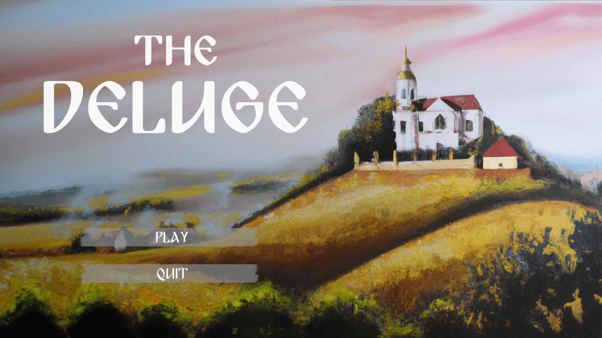
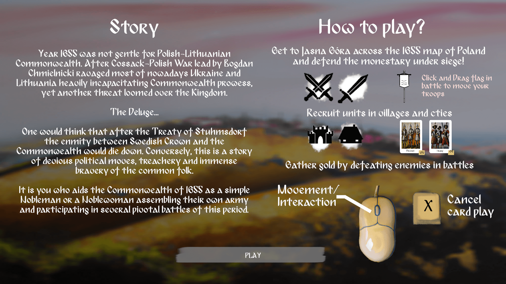
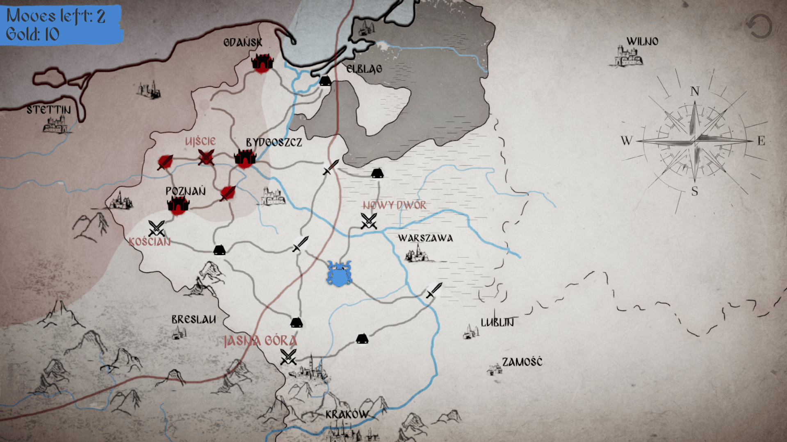
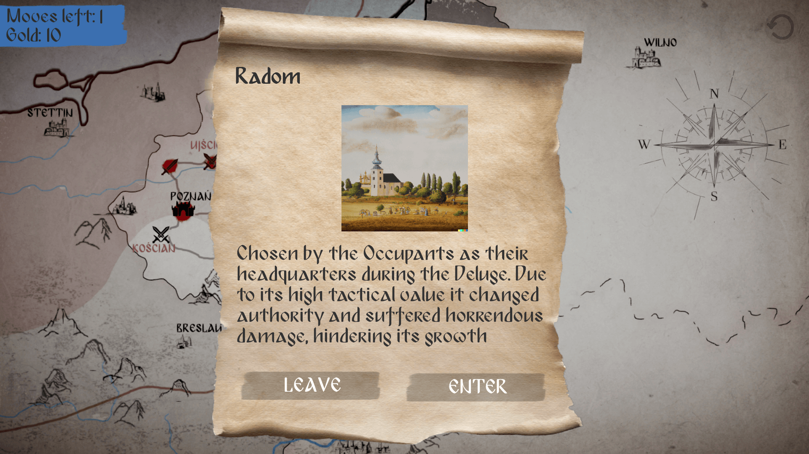
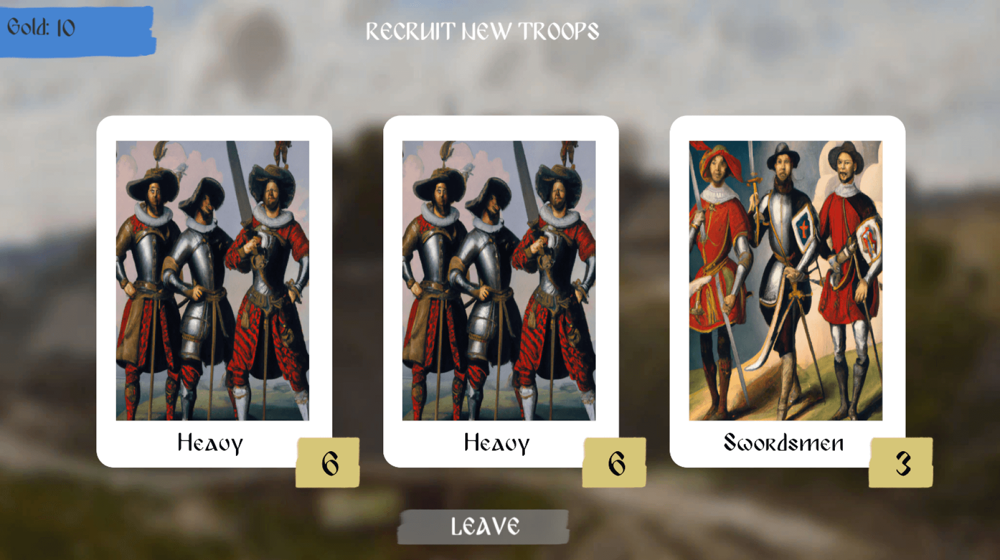
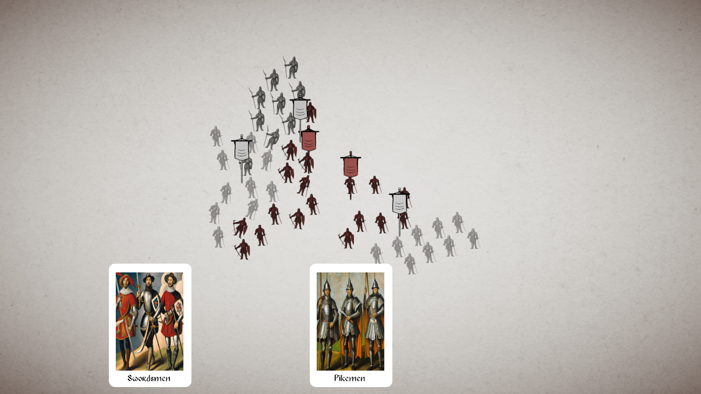
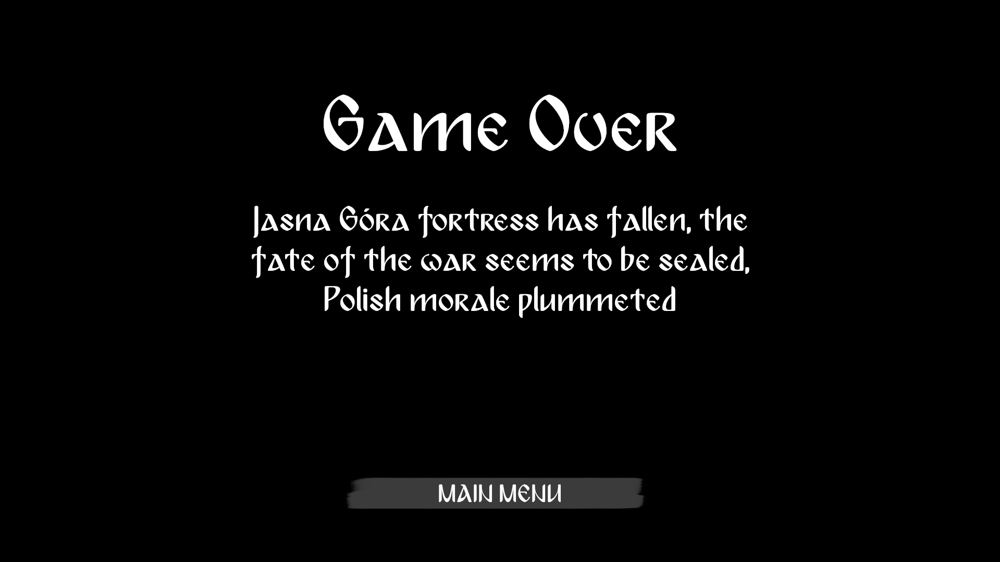

# HackYeah22: The Deluge

## Intro to game

Year 1655 was not gentle for Polish-Lithuanian Commonwealth. After Cossack-Polish War led by Bogdan Chmielnicki ravaged most of nowadays Ukraine and Lithuania heavily incapacitating Commonwealth prowess, yet another threat loomed over the Kingdom.

The Deluge...

One would think that after the Treaty of Stuhmsdorf the enmity between Swedish Crown and the Commonwealth would die down. Conversely, this is a story of devious political moves, treachery and immense bravery of the common folk.

It is you who aids the Commonwealth of 1655 as a simple Nobleman or a Noblewoman assembling their own army and participating in several pivotal battles of this period.

PL:
Rok 1655 nie był łagodny dla Rzeczpospolitej Polsko-Litewskiej. Po tym, jak wojna Kozacko-Polska pod wodzą Bogdana Chmielnickiego spustoszyła większość dzisiejszej Ukrainy i Litwy, mocno osłabiając gotowość do walki Rzeczypospolitej, nad Królestwem zawisło kolejne zagrożenie.

Potop Szwedzki...

Można by pomyśleć że po traktacie Stuhmsdorfskim wrogość między Koroną Szwedzką a Rzecząpospolitą wygasłaby. Wręcz przeciwnie, jest to opowieść o przebiegłych posunięciach politycznych, zdradzie i ogromnej odwadze zwykłych ludzi.

To ty pomagasz Rzeczypospolitej z 1655 roku jako zwykły szlachcic lub szlachcianka, gromadząc własną armię i uczestnicząc w kilku kluczowych bitwach tego okresu.

## Movement:
Click on a house or sword icon to move your character to this location

Choosing a card:
Select a card that is currently highlighted and add it to your deck

Battle Screen:
Drag and drop cards from your deck to spawn units.
Press 'X' key on keyboard while holding a card to cancel dropping a card.
Drag the flag associated with a unit squad to make it move there.
When enemies are nearby, units go towards them unless recalled by using a flag.

## Game preview

Gameplay: https://youtu.be/E-iCmaZBLpg

    
    
    
    
    
    
    

## Resources used:

Some of the art created for this project was generated usng OpenAI DALLE.

Music: https://pixabay.com/music/build-up-scenes-perun-perunie-vox-by-izabela-szturemska-slavic-background-music-117592/

## Developed by:

*Sticky Piston Studios*

Mateusz Szymonski
Jakub Duchniewicz
Szymon Duchniewicz

